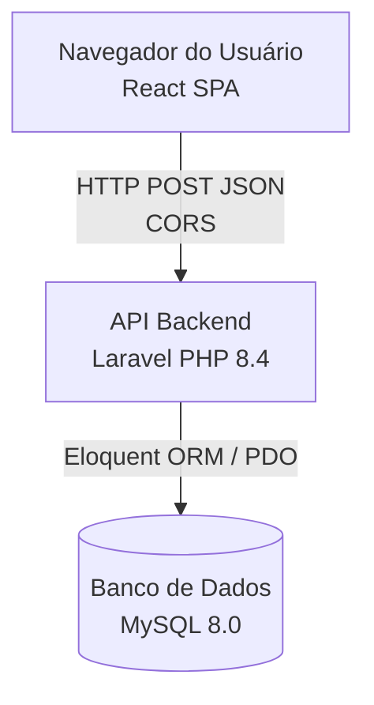

# Documento de Arquitetura do Sistema
**Projeto:** Cidadão Digital

## 1. Visão Geral da Arquitetura

O sistema "Cidadão Digital" adota uma arquitetura em **três camadas (Three-Tier Architecture)** composta por um Frontend React (SPA), uma API Backend em PHP (Framework Laravel) e um Banco de Dados MySQL. A comunicação entre o frontend e backend é feita através de requisições HTTP RESTful (JSON).



## 2. Componentes da Arquitetura

### 2.1. Frontend (Camada de Apresentação)
- **Tecnologia:** React 18, Vite.
- **Padrão:** Single Page Application (SPA).
- **Gerenciamento de Estado:** React Hooks (`useState`, `useEffect`, Custom Hooks como `useGameProgress`).
- **Principais Módulos:**
  - `VisualNovelEngine.jsx`: Motor de renderização do jogo, controla o fluxo de diálogos, efeito de digitação (typewriter) e interface de escolhas.
  - `PerfilAluno.jsx`: Painel analítico (dashboard) que renderiza os resultados da análise de perfil (gráficos e scores).
- **Estrutura de Dados:** Arquivos independentes exportando objetos JSON para cada fase (ex: `fase1.js`, `roadmap20fases.js`). 

### 2.2. Backend (Camada Lógica de Negócio e API)
- **Tecnologia:** PHP 8.4, Framework Laravel.
- **Padrão:** RESTful API estruturada utilizando rotas, controllers e models do ecossistema Laravel.
- **Principais Módulos:**
  - Endpoints de Decisão (`DecisionController`): Recebe as escolhas do usuário, valida a request, registra o XP e salva o log no banco.
  - Endpoints de Perfil (`ProfileService/Controller`): Módulo complexo responsável pela Inteligência Pedagógica. Analisa o histórico e atribui pesos a cada tipo de aluno.
- **Segurança:** Uso do Eloquent ORM e Query Builder para prevenção automática contra Injeção de SQL, middleware CORS do Laravel e validação nativa de requests.

### 2.3. Banco de Dados (Camada de Persistência)
- **Tecnologia:** MySQL 8.0+.
- **Modelagem:** Relacional. Focado em tracking e logging de eventos educacionais do aluno (telemetria).

## 3. Topologia e Implantação (Deployment)

O sistema foi desenhado para hospedar de maneira simples e econômica (ex: Hostinger).

```mermaid
graph LR
    subgraph Hostinger Servidor Compartilhado
        Web[Servidor Web Apache/Nginx]
        App[Laravel (PHP FPM)]
        MySQL[(MySQL Server)]
        
        Web -->|Arquivos Estáticos| Frontend(Dist do React)
        Web -->|Requisições API| App
        App --> MySQL
    end
```

- **Frontend:** Build de produção (`dist/` gerado via `npm run build`) colocado no diretório `public_html/`. Configuração `base: './'` no Vite.
- **Backend:** Scripts `.php` da pasta `api/` mapeados diretamente no servidor web. Configurações sensíveis controladas por `.env` e acesso negado a arquivos sensíveis através de regras do `.htaccess`.
- **Banco de Dados:** Importação direta do `schema.sql`.

## 4. Segurança

- **Credenciais:** Variáveis de banco de dados (`DB_HOST`, `DB_USER`, `DB_PASS`) armazenadas em `.env` que NÃO é versionado (`.gitignore`).
- **Proteção do Ambiente:** Um arquivo `.htaccess` no backend impede a leitura de qualquer arquivo que comece com `.env`.
- **SQL Injection:** Absolutamente todo o tráfego com o banco de dados é sanitizado pelo PDO usando placeholders (`?` e bindings nomeados).
