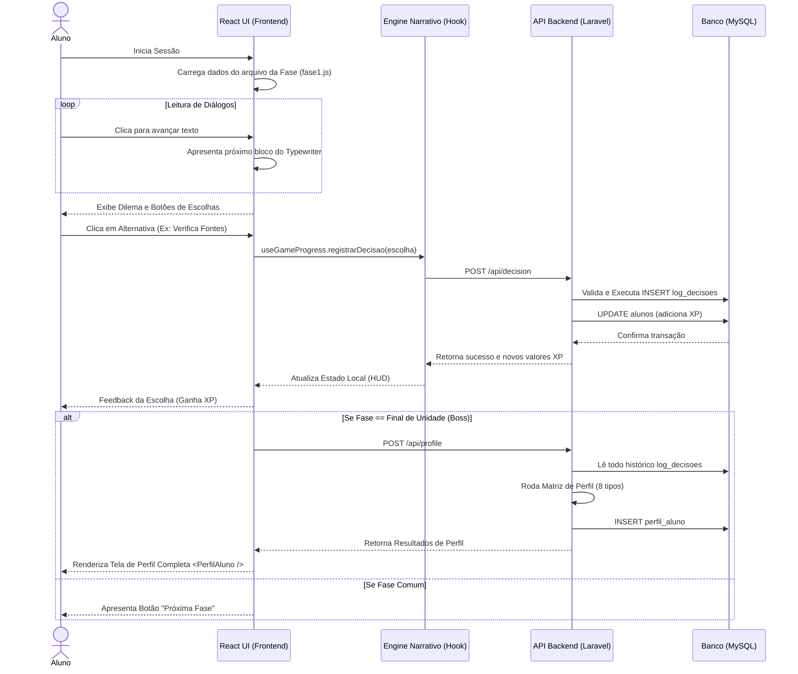

# Documento de Fluxo do Sistema
**Projeto:** Cidadão Digital

## 1. Fluxo de Sessão do Usuário

O diagrama abaixo elucida a trajetória do jogador desde seu início em uma fase, a decisão perante um dilema, até a finalização e roteamento para o cálculo de perfil.



## 2. Fluxo da Lógica de Cálculo de Perfil (Motor Pedagógico)

```mermaid
flowchart TD
    A[Disparo: Conclusão Fase Milestone] --> B[Obter Histórico Total de Decisões do Aluno]
    B --> C{Há Decisões Suficientes?}
    C -- Sim --> D[Mapeamento Decisão X Dimensões]
    C -- Não --> Z[Reter Classificação Atual / Default]
    D --> E[Somar Pontos para Cada Tipo: Critico, Etico...]
    E --> F[Normalizar (0-100%)]
    F --> G[Encontrar Top Score (Tipo Dominante)]
    G --> H[Calcular Deltas (Grau de Confiança)]
    H --> I[Montar Objeto de Recomendação]
    I --> J[Persistir Perfil em Banco (Tabela perfil_aluno)]
    J --> K[Devolver JSON formatado para Interface]
```

## 3. Fluxo Excepcional (Erro de Conectividade)
Caso haja falha de conexão do frontend com a API no momento em que a decisão é enviada, o sistema aborta a progressão da fase temporariamente, garantindo que o `xp` no frontend nunca destoe severamente da integridade do backend. A interface propõe uma repetição da ação HTTP sem perda da linha de diálogo.
