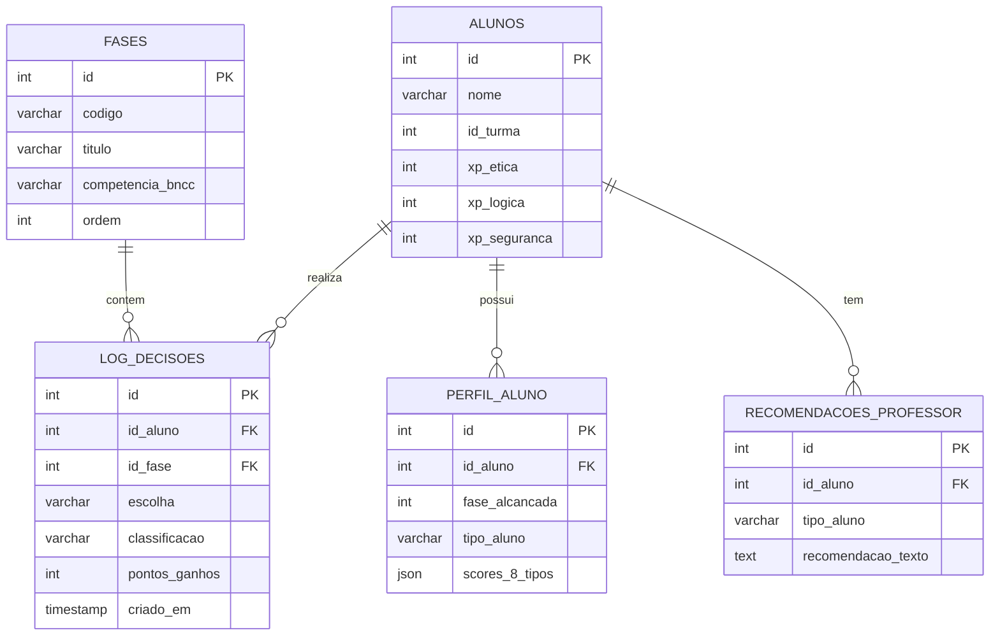

# Modelo de Banco de Dados
**Projeto:** Cidadão Digital

## 1. Visão Geral Conceptual

O sistema Cidadão Digital utiliza um banco de dados relacional MySQL (8.0+) para registrar e extrair telemetria sobre o andamento e perfil do aluno.

## 2. Dicionário de Dados

### 2.1 Tabela: `alunos`
Armazena a identificação e a progressão sumária do aluno no jogo.
- **`id`**: (INT, PK, Auto Increment) - Identificador único do aluno.
- **`nome`**: (VARCHAR 255) - Nome completo ou apelido do aluno.
- **`id_turma`**: (INT) - Referência externa ou interna para agrupamento.
- **`xp_etica`**: (INT) - Acúmulo bruto de pontos éticos.
- **`xp_logica`**: (INT) - Acúmulo bruto de raciocínio crítico.
- **`xp_seguranca`**: (INT) - Acúmulo bruto de práticas de proteção de dados.

### 2.2 Tabela: `fases`
Repositório das fases estáticas, preenchidas no seed (`schema.sql`).
- **`id`**: (INT, PK, Auto Increment) - ID sequencial.
- **`codigo`**: (VARCHAR 50) - Código único legível (ex: BOLHA_001).
- **`competencia_bncc`**: (VARCHAR 255) - Ligação à grade curricular nacional.
- **`ordem`**: (INT) - Ordenamento sequencial (1 a 20).

### 2.3 Tabela: `log_decisoes`
Extrato de alta granularidade (Telemetria) documentando cada clique em dilema efetuado.
- **`id_aluno`**: (INT, FK) - Referência ao Aluno.
- **`id_fase`**: (INT, FK) - Referência à Fase em questão.
- **`escolha`**: (VARCHAR 100) - O identificador da decisão escolhida.
- **`classificacao`**: (ENUM) - Classificação primária de feedback (correta, neutra, catastrofica).
- **`pontos_ganhos`**: (INT) - Valor do impacto somado/retirado.
- **`criado_em`**: (TIMESTAMP) - Controle cronológico das ações.

### 2.4 Tabela: `perfil_aluno`
Agrega o resultado histórico das avaliações do algoritmo de Inteligência Pedagógica.
- **`fase_alcancada`**: (INT) - Milestone avaliativo onde este perfil foi calculado.
- **`tipo_aluno`**: (VARCHAR 50) - Tipo dominante detectado na ocasião.
- **`scores_8_tipos`**: (JSON) - Dicionário key-value persistindo o balanço percentual calculado.

### 2.5 Tabela: `recomendacoes_professor`
Insights mastigados diretamente para a visão do educador no dashboard.
- **`tipo_aluno`**: (VARCHAR 50) - Chave relacional conceitual do tipo que originou a recomendação.
- **`recomendacao_texto`**: (TEXT) - Frase de dica pedagógica, pronta para aplicação humana.
